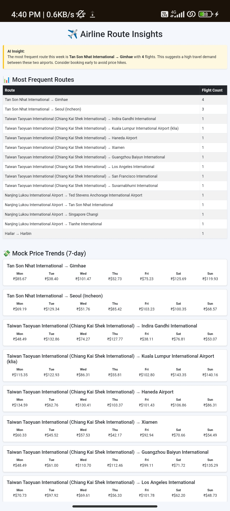

# ✈️ Airline Booking App


# ✈️ Airline Booking Insights App

A Flask web app that fetches real-time airline route data using the AviationStack API, analyzes the most frequent flight routes, simulates weekly mock price trends, and generates AI-based travel insights.  
Deployed live on [PythonAnywhere](https://aashishjangir.pythonanywhere.com/).

---

## 🚀 Live Demo

🌐 **[Click here to try the app](https://aashishjangir.pythonanywhere.com/)**

---

## 📸 Screenshot

*(Screenshot of the results page)*  


---

## 🧰 Features

- ✅ Fetches real-time flight data using **AviationStack API**  
- ✅ Displays **top flight routes** and their frequency  
- ✅ Simulates **mock price trends over 7 days**  
- ✅ Generates **AI-based travel insight** on high-demand routes  
- ✅ Beautiful UI with animations, background images  
- ✅ Live deployment on **PythonAnywhere**

---

## 🔧 Tech Stack

| Technology        | Description                     |
|-------------------|----------------------------------|
| **Python 3.13**   | Backend logic and API handling  |
| **Flask**         | Web framework                   |
| **Jinja2**        | Templating engine               |
| **Pandas**        | Data aggregation                |
| **HTML/CSS/Bootstrap** | Frontend & styling         |
| **AviationStack API** | Live flight data source     |
| **PythonAnywhere** | Hosting and deployment         |

---

## 📦 Installation

```bash
git clone https://github.com/Aashishjangir112/airline_booking_app.git
cd airline_booking_app
pip install -r requirements.txt
python app.py
